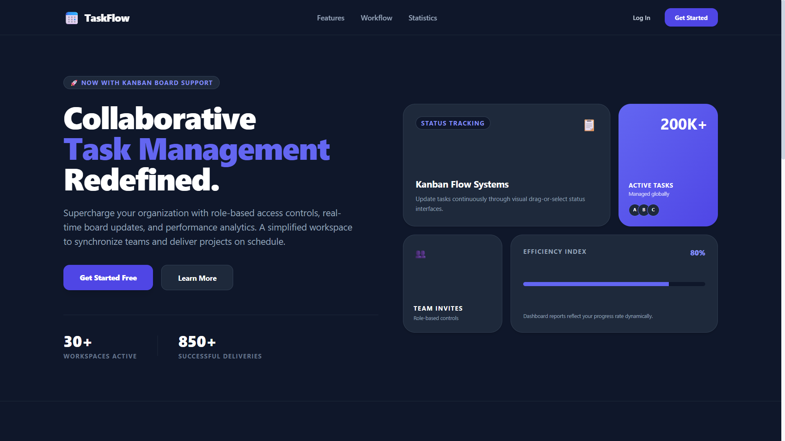
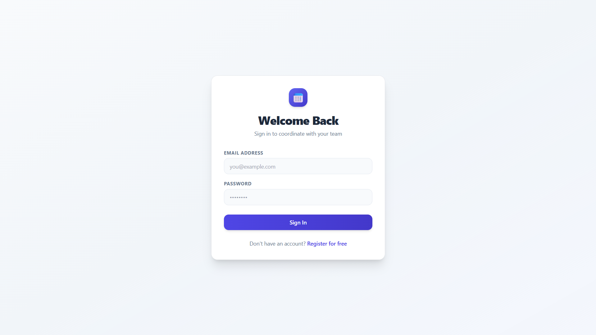
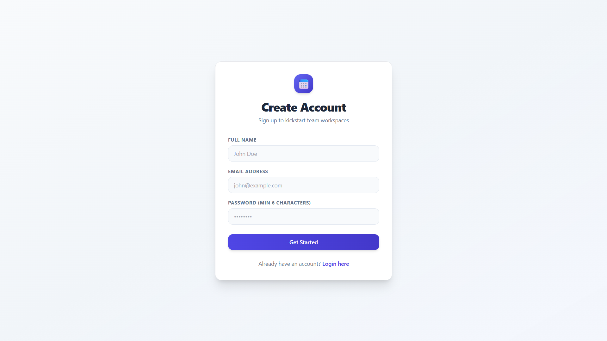
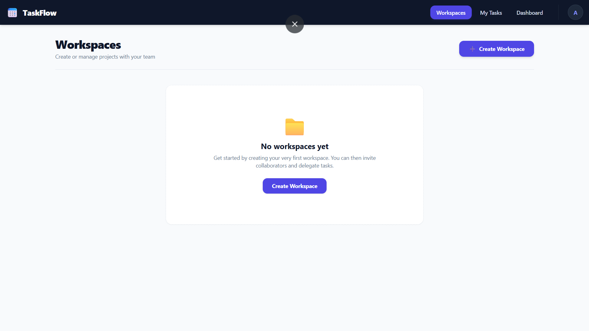

# Team Task Manager

A full-stack Team Task Management web application where users can create projects, manage teams, assign tasks, and track progress using role-based access control.

Inspired by tools like Trello and Asana, this application enables collaborative task management with secure authentication and project-level permissions.

---

# Live Demo

## Frontend
https://your-frontend-url

## Backend API
https://your-backend-url

---

# Features

## Authentication
- User Signup & Login
- JWT-based Authentication
- Protected Routes
- Secure Password Hashing using bcryptjs

## Project Management
- Create Projects
- Add/Remove Team Members
- Project-based Team Collaboration
- Admin & Member Roles

## Task Management
- Create Tasks
- Assign Tasks to Team Members
- Task Priority & Due Dates
- Task Status Tracking
  - To Do
  - In Progress
  - Done

## Dashboard
- Total Tasks Overview
- Tasks by Status
- Overdue Tasks
- User-wise Task Tracking

## Security & Access Control
- Role-Based Access Control (RBAC)
- Protected Backend APIs
- Admin-only Actions
- Member-specific Permissions

---

# Tech Stack

## Frontend
- React
- Vite
- Tailwind CSS
- Axios
- React Router DOM

## Backend
- Node.js
- Express.js
- MongoDB Atlas
- Mongoose

## Authentication & Security
- JWT (JSON Web Tokens)
- bcryptjs

## Deployment
- Railway

---


## Folder Structure

```bash
team-task-manager/
│
├── backend/
│   ├── config/
│   │   └── db.js
│   │
│   ├── controllers/
│   │   ├── authController.js
│   │   ├── projectController.js
│   │   └── taskController.js
│   │
│   ├── middleware/
│   │   └── auth.js
│   │
│   ├── models/
│   │   ├── User.js
│   │   ├── Project.js
│   │   └── Task.js
│   │
│   ├── routes/
│   │   ├── auth.js
│   │   ├── projects.js
│   │   └── tasks.js
│   │
│   ├── server.js
│   ├── package.json
│   └── .env
│
├── frontend/
│   ├── src/
│   │   ├── components/
│   │   │   ├── AddMemberModal.jsx
│   │   │   ├── Navbar.jsx
│   │   │   ├── PrivateRoute.jsx
│   │   │   ├── ProjectCard.jsx
│   │   │   ├── TaskCard.jsx
│   │   │   └── TaskForm.jsx
│   │   │
│   │   ├── context/
│   │   │   └── AuthContext.jsx
│   │   │
│   │   ├── pages/
│   │   │   ├── Dashboard.jsx
│   │   │   ├── Landing.jsx
│   │   │   ├── Login.jsx
│   │   │   ├── MyTasks.jsx
│   │   │   ├── Profile.jsx
│   │   │   ├── ProjectDetails.jsx
│   │   │   ├── Projects.jsx
│   │   │   └── Signup.jsx
│   │   │
│   │   ├── utils/
│   │   │   └── api.js
│   │   │
│   │   ├── App.jsx
│   │   ├── main.jsx
│   │   └── index.css
│   │
│   ├── package.json
│   ├── tailwind.config.js
│   ├── postcss.config.js
│   └── .env
│
└── README.md
```

## Installation and Setup
1. Clone the repository
   ```bash
   git clone <repo-url>
   cd team-task-manager
   ```

2. Backend setup
   ```bash
   cd backend
   npm install
   ```
   Create `.env` with:
   ```dotenv
   PORT=5000
   MONGODB_URI=<your_mongo_uri>
   JWT_SECRET=<your_jwt_secret>
   NODE_ENV=development
   ```
   Start backend:
   ```bash
   npm start
   ```

3. Frontend setup
   ```bash
   cd ../frontend
   npm install
   npm run dev
   ```

4. Open the app
   - Visit `http://localhost:5173` or the Vite dev URL

## Screenshots
Add screenshots to the repo by placing image files in the root or a `screenshots/` folder.
- Example file: `screenshots/project-board.png`
- In README, reference it like:
  ```markdown
  
  
  
  
  ```

## Role Based Access
- **Project Admin**
  - create projects
  - add members
  - create, update, delete tasks
- **Project Member**
  - view project details
  - update task status if assigned
  - view dashboard and tasks

## Future Improvements
- Forgot Password functionality
- Email Verification
- Real-time Notifications
- Drag & Drop Kanban Board
- File Attachments

## Author
- Abhinav Chaudhary

## License
- MIT
